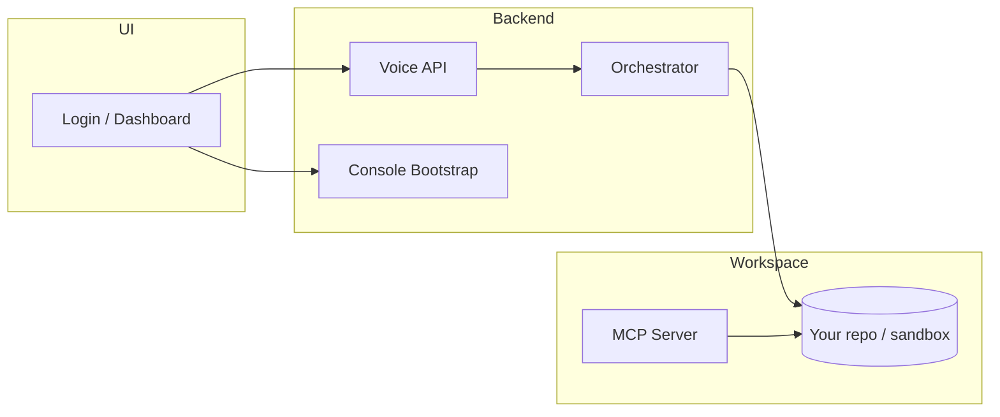

# VoiceOps — AI On-Call Engineer

Voice-first on-call console for investigating incidents, patching code, and running tests — all scoped to a real repository via MCP.

Hold **space** or tap the mic, say *"investigate what's failing"*, and VoiceOps reads your repo, runs tests, and applies fixes in the connected workspace.

---

## What it does

- **Voice pipeline** — speech or text → Whisper STT → intent extraction → normalized commands
- **On-call console** — incident dashboard driven by the logged-in user and connected repo (empty until a workspace is linked)
- **Workspace orchestrator** — investigate, run pytest, patch files in `VOICEOPS_WORKSPACE`
- **MCP server** — Cursor agent tools (`read_file`, `write_file`, `run_command`, …) scoped to the same repo
- **Role-based auth** — viewer, on-call, and admin roles with JWT login

---

## Architecture



**Pipeline**

```
Audio/Text → STT (Whisper) → Intent (OpenAI) → Normalization → Context → Orchestrator → repo files + pytest
```

---

## Quick start

### 1. Backend

```bash
cd backend
python -m venv .venv

# Windows
.venv\Scripts\activate
# macOS / Linux
source .venv/bin/activate

pip install -r requirements.txt
copy .env.example .env        # Windows
# cp .env.example .env        # macOS / Linux
```

Edit `backend/.env`:

```env
OPENAI_API_KEY=sk-...
VOICEOPS_WORKSPACE=sandbox
```

Start the server:

```bash
uvicorn app.main:app --host 127.0.0.1 --port 8001
```

### 2. Open the console

| UI | URL | When to use |
|----|-----|-------------|
| **HTML dashboard** | http://127.0.0.1:8001/dashboard | Default — fully wired to voice + orchestrator |
| **Login** | http://127.0.0.1:8001/ | Redirects to login if not authenticated |
| **React (dev)** | http://localhost:5191 | `cd frontend && npm install && npm run dev` |
| **API docs** | http://127.0.0.1:8001/docs | OpenAPI / Swagger |

### 3. Demo accounts

| Email | Password | Role | Can use voice |
|-------|----------|------|----------------|
| `priya@voiceops.dev` | `oncall123` | On-call | Yes |
| `viewer@voiceops.dev` | `view123` | Viewer | No (read-only) |
| `admin@voiceops.dev` | `admin123` | Admin | Yes |

### 4. Try voice commands

Log in as **Priya**, allow the microphone, then try:

- *"Investigate what's failing in sandbox"*
- *"Run tests"*
- *"Fix the health endpoint"*

The agent returns a **short summary** (not raw pytest logs). Expand **Raw test output** in the chat for details.

---

## Connect a repository (MCP + dashboard)

Both the **backend** and **MCP server** must point at the same folder.

**`backend/.env`**

```env
VOICEOPS_WORKSPACE=sandbox
```

**`.cursor/mcp.json`** (copy from `.cursor/mcp.json.example`)

```json
{
  "mcpServers": {
    "voiceops-workspace": {
      "command": "backend/.venv/Scripts/python.exe",
      "args": ["mcp-server/server.py"],
      "cwd": "${workspaceFolder}",
      "env": { "VOICEOPS_WORKSPACE": "sandbox" }
    }
  }
}
```

Use a relative path (`sandbox`) or an absolute path to any repo on disk.

After changing config:

1. Restart the backend
2. Reload MCP in Cursor (**Settings → MCP**)
3. Hard-refresh the dashboard

When connected, the console shows the repo name, branch, and MCP integration status. With no workspace set, the UI stays in an empty **disconnected** state.

---

## Sandbox demo

`sandbox/` is a minimal **checkout-api** FastAPI app for trying agent actions locally.

```bash
cd sandbox
pip install -r requirements.txt
pytest
```

Use it to practice investigate → patch → verify flows without touching production code.

See [`sandbox/README.md`](sandbox/README.md) for MCP prompt examples in Cursor.

---

## Deploy on Render + GitHub PRs

Full step-by-step guide: **[`docs/DEPLOY_RENDER.md`](docs/DEPLOY_RENDER.md)**

Summary:

1. Deploy via `render.yaml` (Docker + `/data` persistent disk)
2. Set `GITHUB_REPO`, `GITHUB_DEPLOY_TOKEN`, and GitHub OAuth env vars
3. Log in to the dashboard → **click GitHub** in integrations to connect
4. Voice-fix your repo → when all tests pass, VoiceOps opens a PR you merge on GitHub

---

## MCP tools

| Tool | Description |
|------|-------------|
| `workspace_info` | Active workspace path and README line |
| `list_directory` | List files under a path |
| `read_file` | Read a text file |
| `write_file` | Create or overwrite a file |
| `search_files` | Grep-like search in the workspace |
| `run_command` | Allowlisted: `python`, `pytest`, `pip`, read-only `git` |

---

## API reference

### Auth

| Method | Endpoint | Description |
|--------|----------|-------------|
| POST | `/auth/login` | Email + password → JWT |
| GET | `/auth/me` | Current user (Bearer token) |

### Console

| Method | Endpoint | Description |
|--------|----------|-------------|
| GET | `/console/bootstrap` | User, workspace, incidents, integrations |

### Voice

| Method | Endpoint | Description |
|--------|----------|-------------|
| POST | `/voice/process-audio` | Push-to-talk audio upload |
| POST | `/voice/process-text` | Text command (dev / fallback) |
| DELETE | `/voice/sessions/{id}` | Clear session memory |
| GET | `/voice/health` | STT / LLM / workspace status |

### Example — process text

```bash
TOKEN=$(curl -s -X POST http://127.0.0.1:8001/auth/login \
  -H "Content-Type: application/json" \
  -d '{"email":"priya@voiceops.dev","password":"oncall123"}' | jq -r .access_token)

curl -X POST http://127.0.0.1:8001/voice/process-text \
  -H "Authorization: Bearer $TOKEN" \
  -H "Content-Type: application/json" \
  -d '{"text":"investigate sandbox","session_id":"demo"}'
```

---

## Configuration

See [`backend/.env.example`](backend/.env.example).

| Variable | Description | Default |
|----------|-------------|---------|
| `STT_PROVIDER` | `whisper` or `aws` | `whisper` |
| `WHISPER_MODEL` | Whisper model size | `tiny` |
| `LLM_PROVIDER` | `openai`, `bedrock`, or `mock` | `mock` |
| `OPENAI_API_KEY` | Required when `LLM_PROVIDER=openai` | — |
| `TTS_ON_VOICE` | Server-side TTS on voice requests | `false` |
| `VOICEOPS_WORKSPACE` | Repo path for dashboard + orchestrator | empty |
| `JWT_SECRET` | Sign auth tokens | change in production |

---

## Project structure

```
VoiceOps---AI-OnCall-Engineer/
├── backend/
│   ├── app/
│   │   ├── auth/           # JWT login, roles, permissions
│   │   ├── console/        # Dashboard bootstrap API
│   │   ├── orchestrator/   # Workspace investigate / test / patch
│   │   ├── voice_agent/    # STT, intent, normalization, TTS
│   │   └── workspace/      # Repo file + shell tools
│   └── tests/
├── design/
│   ├── login.html
│   └── incident-dashboard.html   # Primary wired UI
├── frontend/                     # React + Vite dashboard
├── mcp-server/                   # MCP tools for Cursor
├── sandbox/                      # Demo checkout-api
└── .cursor/mcp.json.example
```

---

## Development

### Tests

```bash
cd backend
pytest
```

### React frontend

```bash
cd frontend
npm install
npm run dev      # http://localhost:5191 — proxies API to :8001
npm run build    # production build
```

### Common issues

| Problem | Fix |
|---------|-----|
| Dashboard shows "No repo connected" | Set `VOICEOPS_WORKSPACE=sandbox` in `.env` and restart backend |
| `/console/bootstrap` 404 | Stale server on port 8001 — kill old process and restart |
| Port 8001 in use | `netstat -ano \| findstr :8001` then restart, or use another port |
| Mic denied | Allow microphone in browser site settings; tap mic once to prompt |

---

## Roadmap

- [x] Render deployment + GitHub OAuth PR flow — see [`docs/DEPLOY_RENDER.md`](docs/DEPLOY_RENDER.md)
- [ ] Deploy / PR approval flow wired to Render deploy hooks
- [ ] Live incident + metrics feeds (PagerDuty, ClickHouse)
- [ ] Composio MCP integrations (Slack, PagerDuty)
- [ ] Production React build served from FastAPI

---

## License

MIT — see repository for details.
